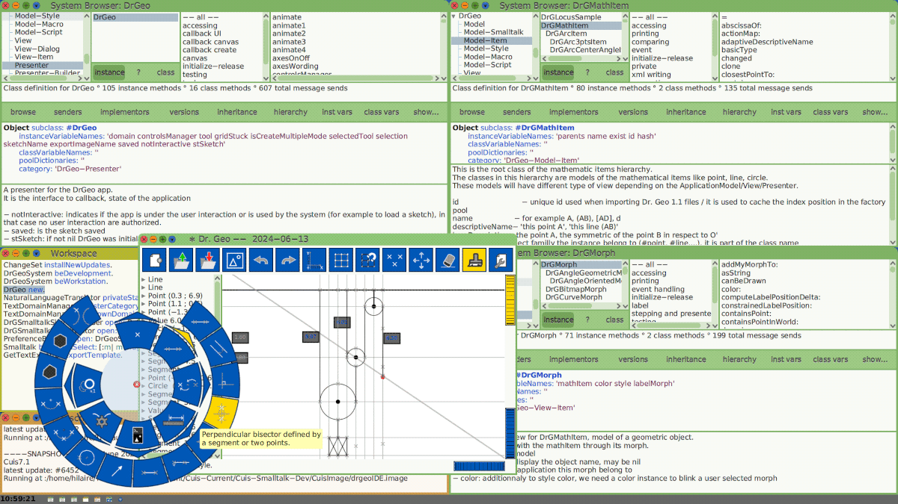

Instructions to install [Dr. Geo](https://www.gnu.org/s/dr-geo/) with
[Cuis-Smalltalk](http://cuis.st) stable or rolling (current) releases.

You can install both stable and current versions of Dr. Geo. You
will use two different working directories though.

# Set-up your development environment

## Stable Dr. Geo 
The stable **Dr. Geo 24.06** is built against
**Cuis7.0**. To build Dr. Geo from source, follow
the instructions in the two sections below.

Set up your working directory for stable:

```bash
mkdir Cuis-Stable
```

### Cuis-Smalltalk code & VM
Fetch and install the stable Cuis-Smalltalk image, VM and the needed
additional packages. You will clone the repositories below with the
appropriate tag to instruct you want the stable versions.

```bash
cd Cuis-Stable
git clone --depth 1 https://github.com/Cuis-Smalltalk/Cuis7-0
git clone --depth 1 --branch Cuis7.0 https://github.com/Cuis-Smalltalk/Cuis-Smalltalk-UI
git clone --depth 1 --branch Cuis7.0 https://github.com/Cuis-Smalltalk/Erudite
git clone --depth 1 --branch Cuis7.0 https://github.com/Cuis-Smalltalk/Numerics
git clone --depth 1 --branch Cuis7.0 https://github.com/Cuis-Smalltalk/Parsers
git clone --depth 1 --branch Cuis7.0 https://github.com/Cuis-Smalltalk/SVG
```

### Dr. Geo code
Fetch the latest stable code of Dr. Geo from its repository.

```bash
cd Cuis-Stable/Cuis7-0
git clone --depth 1  --branch 24.06 https://github.com/Dynamic-book/drgeo
```

## Current Dr. Geo
The Dr. Geo work-in-progress version is based on the [rolling release
version of
Cuis](https://github.com/Cuis-Smalltalk/Cuis-Smalltalk-Dev). Follow
the instructions below to install your Dr. Geo development
environment.

Set up your working directory:
```bash
mkdir Cuis-Current
```

### Cuis-Smalltalk code & VM
Fetch and install the latest versions of Cuis-Smalltalk image, VM and
needed additional packages.

```bash
cd Cuis-Current
git clone --depth 1 https://github.com/Cuis-Smalltalk/Cuis-Smalltalk-Dev
git clone --depth 1 https://github.com/Cuis-Smalltalk/Cuis-Smalltalk-UI
git clone --depth 1 https://github.com/Cuis-Smalltalk/Erudite
git clone --depth 1 https://github.com/Cuis-Smalltalk/Numerics
git clone --depth 1 https://github.com/Cuis-Smalltalk/Parsers
git clone --depth 1 https://github.com/Cuis-Smalltalk/SVG
```

### Dr. Geo code
Fetch the Dr. Geo repository, with source and script.

```bash
cd Cuis-Current/Cuis-Smalltalk-Dev
git clone --depth 1 https://github.com/Dynamic-Book/DrGeo
git clone --depth 1 https://github.com/Dynamic-Book/DyboLib
```

# Dr. Geo Integrated Development Environment
Run the Dr. Geo IDE script. It installs DrGeo code and related
packages into its development environment.

```bash
cd {Cuis-Stable|Cuis-Current}/{Cuis7-0|Cuis-Smalltalk-Dev}
./drgeo/startIDE.sh
```

A new image **drgeoIDE.image** is built in CuisImage and started. This
is the development environment for the Dr. Geo.

In the Workspace window, execute the statement `DrGeoSystem
beDevelopment`, it will set up the paths to the resources to test
appropriately the application.

Then, to open a Dr. Geo window, execute:
```smalltalk
DrGeo new
```



Have an interesting exploration!

# License

Copyright 1998--2025 Hilaire Fernandes
